# "Iniciando la inmersión Digital: Desarrollo de un Entorno de Aprendizaje Inlcusivo y Amigable para Estudiantes en un Mundo Virtual"

-  Maria Fernanda Sanchez Aguilar (Programador)
-  Ulises Ferrusca Jimenez (Programador)
-  Samantha Vianney Almaza Bocanegra (Programador)
-  Adrian Dolores Sanchez Rios (Programador)
-  Nancy Alejandra Tovar Perez (Animador)
-  Mauricio Mosqueda Martínez (Animador)
-  Ludwin Manuel Mendoza Delgadillo (Animador)

## Indice
- [Introducción](#introducción)
- [Sansar](#sansar)
- [Instalación en Sansar](#instalación-en-sansar)
- [Enfoque](#enfoque)
- [Arquitectura de Sansar](#arquitectura-de-sansar)
- [Diseño de Espacios](#diseño-de-espacios)
- [Iconografía](#iconografía)
- [Aspectos Visuales](#aspectos-visuales)
- [Exportación de Archivos](#exportación-de-archivos)
- [Recomendaciones de Diseño](#recomendaciones-de-diseño)
- [Scripts](#scripts)
- [Licencia](#licencia)

## Introducción

**Inclusión Lingüística Virtual** es un proyecto pionero diseñado para crear un entorno inclusivo y accesible en el ámbito digital. El objetivo es facilitar la comunicación y enriquecer la experiencia de los usuarios en mundos virtuales, asegurando que cada persona, independientemente de sus capacidades, pueda participar de manera plena y significativa.

Este software busca eliminar barreras digitales y lingüísticas, ofreciendo:

- Herramientas avanzadas de personalización de avatares.
- Integración de la Lengua de Señas Mexicana (LSM).
- Promoción de la diversidad cultural y lingüística de la comunidad sorda.

Nuestra visión es transformar la interacción digital, creando un espacio donde la inclusión no sea solo un principio, sino una realidad palpable y cotidiana. Queremos que cada usuario tenga la posibilidad de explorar, aprender y colaborar en un entorno virtual amigable y accesible para todos.

### Público Objetivo

El proyecto está diseñado principalmente para alumnos de la **Ingeniería en Robótica Computacional**, y tiene un enfoque especial en la inclusión de personas que utilizan **Lengua de Señas Mexicana (LSM)** y aquellas que se benefician de las funciones de accesibilidad. Creemos en el poder de la tecnología como herramienta para la educación y la inclusión, y queremos asegurar que todos los estudiantes tengan las mismas oportunidades de aprender y desarrollarse.

## Sansar

**Sansar** es una plataforma de realidad virtual y aumentada que permite a los usuarios crear, personalizar y explorar mundos tridimensionales inmersivos. Desarrollada por **Linden Lab**, Sansar ofrece un espacio creativo donde los usuarios pueden colaborar, aprender y disfrutar de experiencias interactivas ricas y significativas.

Sansar permite a los usuarios interactuar entre sí, construir sus propios espacios y compartir contenido. Este proyecto utiliza Sansar como la plataforma principal para crear un entorno de aprendizaje interactivo e inclusivo, aprovechando sus capacidades para representar entornos virtuales complejos que pueden ser explorados y manipulados por los estudiantes.

## Instalación en Sansar

### Requisitos del Sistema

Antes de instalar Sansar, asegúrate de que tu sistema cumpla con los siguientes requisitos:

- **Sistema Operativo:** Windows 10, macOS 11.0 o superior, o una versión compatible de Linux que sea compatible con las distribuciones principales.
- **Procesador:** Intel Core i5 o un procesador equivalente de alto rendimiento.
- **Memoria RAM:** 8 GB o más, para asegurar que las aplicaciones puedan ejecutarse sin problemas, especialmente en entornos complejos.
- **Almacenamiento:** Al menos 20 GB de espacio libre para instalar Sansar y cualquier contenido adicional que desees descargar.
- **Tarjeta Gráfica:** Compatible con **DirectX 11**, preferiblemente de gama media o alta para aprovechar al máximo las capacidades gráficas de Sansar.

### Proceso de Instalación

Para instalar Sansar, sigue los pasos descritos en la "Guía de Instalación" proporcionada junto con el software. Esta guía contiene instrucciones detalladas que te ayudarán a instalar el programa y configurarlo correctamente en tu sistema.
- [Guía de Instalación](https://docs.sansar.com/untitled/sansarbasics/installationandcompatibility/install)

### Configuración Inicial

Una vez completada la instalación, es importante que personalices tu configuración inicial. Durante el primer inicio, Sansar te guiará a través de un asistente que te permitirá ajustar aspectos como la calidad gráfica, los controles, y la configuración de audio para asegurar una experiencia óptima según las capacidades de tu sistema y tus preferencias personales.

## Enfoque

### Programación Estructurada

En el contexto de la **Programación Estructurada**, los estudiantes explorarán los principios fundamentales para escribir código limpio, organizado y eficiente. La programación estructurada se basa en el uso de estructuras de control bien definidas, tales como secuencias, condicionales e iteraciones, para dividir un problema complejo en pequeñas partes manejables.

Los principales temas que serán abordados incluyen:

- **Control de Flujo**: Cómo dirigir la ejecución del programa para cumplir con los requerimientos de la lógica deseada.
- **Funciones y Modularidad**: Dividir un programa en funciones reutilizables para mejorar la claridad y la reutilización del código.
- **Estructuras de Datos y Algoritmos**: Trabajar con diferentes tipos de estructuras de datos y aplicar algoritmos adecuados según el problema a resolver.

Este enfoque práctico permitirá a los estudiantes aplicar estos principios en el diseño y desarrollo de programas dentro del ámbito de la robótica y la simulación.

### Visión

El objetivo de este módulo es enseñar de manera didáctica y sencilla los conceptos de la programación estructurada, de forma que los estudiantes puedan entender la lógica detrás de la construcción de programas sin ser abrumados con detalles excesivamente técnicos al inicio. Nos enfocamos en una enseñanza interactiva y práctica que permita a los estudiantes aprender haciendo.

#### Estructura Secuencial
La **estructura secuencial** está formada por una serie de instrucciones que se ejecutan en el orden en el cual fueron escritas, de forma lineal y sin saltos. Este tipo de estructura se utiliza para ejecutar una serie de pasos de manera ordenada y lógica.

#### Estructura Condicional
La **estructura condicional** permite al programa tomar decisiones. Estas decisiones están basadas en evaluaciones booleanas (verdadero o falso) y permiten que el flujo del programa cambie dependiendo de las circunstancias. Esto es fundamental para que un programa sea interactivo y pueda responder de manera dinámica a diferentes situaciones.

#### Estructura Iterativa
La **estructura iterativa** o bucle se utiliza para repetir un bloque de código un número determinado de veces o mientras se cumpla una determinada condición. Esto es especialmente útil para automatizar tareas repetitivas, como la lectura de una serie de datos o la simulación de un proceso.

## Arquitectura de Sansar

### Diseño del Espacio
- **Escenarios Circulares**: Utilizamos escenarios circulares para proporcionar una navegación más amigable y efectiva en entornos de realidad virtual. La funcionalidad de los modelos curvos o circulares es fundamental ya que permiten una interacción más intuitiva para los usuarios. 
- **Pasillos Curvos**: Los pasillos tienen curvas que guían a los usuarios de manera intuitiva a través del espacio. Estas curvas pueden ser más efectivas al visualizar el entorno en realidad virtual, facilitando la navegación.
- **Colores Neutros e Iluminación Cálida**: Se emplean colores neutros y una iluminación cálida para crear un ambiente agradable y acogedor.
- **Vistas Coloridas para Ejercicios**: Las vistas están diseñadas para motivar a los usuarios durante los ejercicios, utilizando colores que generen un ambiente motivador.

### Materiales Utilizados
Todo el material se conceptualiza para el diseño del mundo en Sansar. Los archivos se exportan en los formatos **FBX** y **OBJ**, mientras que la texturación se realiza con **Autodesk Maya**.

## Diseño de Espacios

### Sala Principal
- **Puertas y Accesos**: La sala principal contiene puertas de entrada a los diferentes niveles. Estas puertas están diseñadas para aprovechar mejor el espacio, utilizando formas adaptables como la media píldora.
- **Funcionalidad**: La sala principal será el lugar donde los usuarios iniciarán las tareas o actividades, sirviendo como un punto de partida para el resto del mundo virtual.

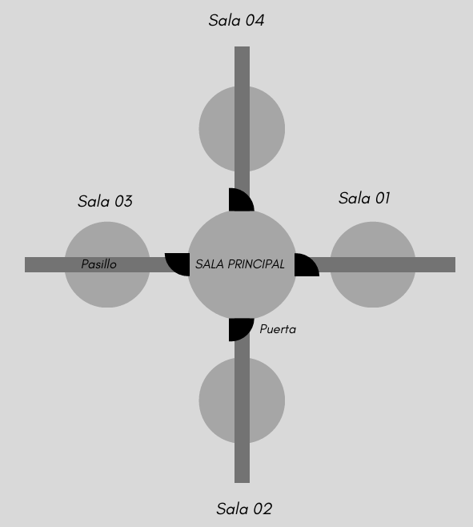

### Sala 01 - Sala de Ejercicios
- **Forma Circular**: La sala de ejercicios tiene una forma circular que permite añadir más niveles y ampliar el diseño. Esto facilita la incorporación de nuevas salas y actividades en el futuro.
- **Pasillo de Conexión**: Pasillo que conecta la Sala Principal con las otras salas de ejercicios, permitiendo un flujo continuo en la experiencia del usuario.

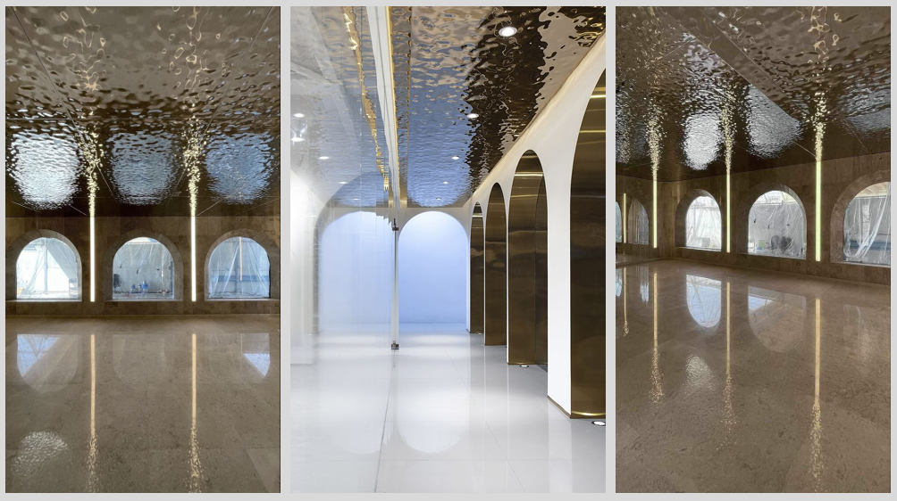
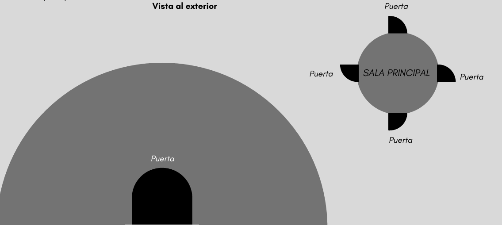

### Psicología del Diseño
- **Formas Circulares**: Las formas circulares ayudan a aprovechar mejor el espacio, facilitando la comprensión y navegación dentro del entorno. Según la psicología de las formas, los círculos son adaptables y ayudan a crear un espacio amigable.
- **Geometrías Primitivas**: El uso de geometrías primitivas no solo optimiza el espacio, sino que también reduce la densidad poligonal, haciendo los archivos más ligeros y eficientes para ser procesados en VR.

## Iconografía

### Iconografía en el Espacio
- **Espacio de Iconografía y LSM**: Se ha diseñado un espacio donde se utilizarán íconos cuadrados curvos y puertas en forma de media píldora para mantener un equilibrio visual.
- **Iconografía para Ejercicios**: Se emplean íconos simples y colores contrastantes para resaltar la información importante, tanto en movimiento como estática. Los iconos utilizados deben ser fáciles de entender y claros para transmitir si las acciones son correctas o incorrectas.

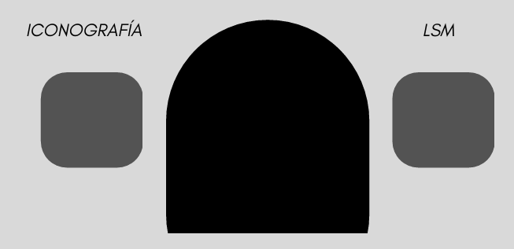

## Aspectos Visuales

### Funcionalidad y Estética
- **Curvas y Modelos Circulares**: Los modelos curvos y circulares mejoran la eficiencia en la construcción y el aprovechamiento del espacio.
- **Bajo Costo Computacional**: La baja densidad poligonal facilita el procesamiento de los archivos en VR, asegurando que la experiencia del usuario sea fluida y sin interrupciones.

### Bloques y Ensamblaje
- **Bloques Neutros y de Colores**: Se emplean bloques neutros y de colores para la construcción de diferentes ejercicios. El diseño tipo "Tetris" ofrece múltiples opciones de ensamblaje, lo cual permite una mayor flexibilidad y creatividad en el diseño de los ejercicios.

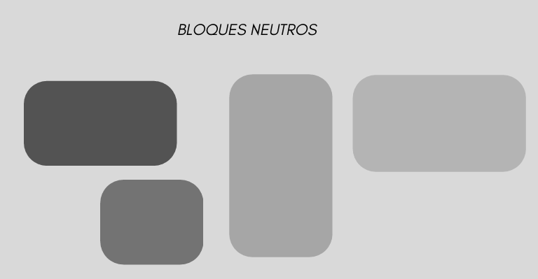

## Recomendaciones de Diseño
- **Pasillos Curvos**: Guían de manera natural al usuario y mejoran la orientación en el espacio.
- **Colores Neutros e Iluminación Cálida**: Mejora la experiencia visual, creando un ambiente relajante y cómodo.
- **Iconos Contrastantes**: Ayudan a resaltar la información esencial, facilitando la comprensión de las instrucciones para los ejercicios.

## Scripts

El siguiente apartado proporciona detalles sobre los **scripts** que se utilizan en el mundo virtual de Sansar. Estos scripts permiten la creación e interacción con elementos del entorno, desde portales hasta luces, objetos, audio, y modelos 3D. Cada subsección explica cómo funcionan y cómo pueden ser implementados dentro del proyecto.

#### Exportar Scripts

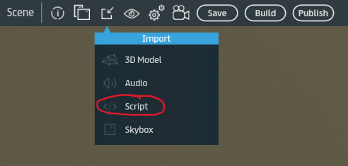
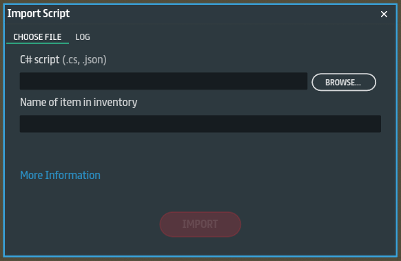

### Portales

Los **portales** son elementos interactivos que permiten a los usuarios trasladarse de un lugar a otro dentro del mundo virtual de Sansar-Mundo. El script para los portales gestiona la detección del usuario y la teleportación.

#### Script:

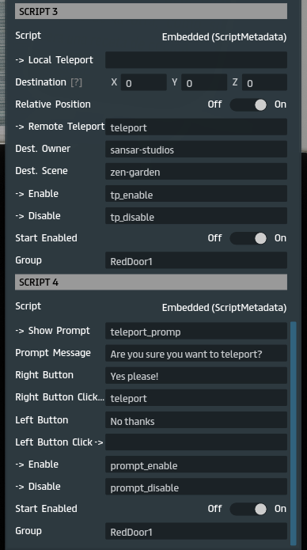

##### Puerta
La puerta fue descargada de la tienda de sansar
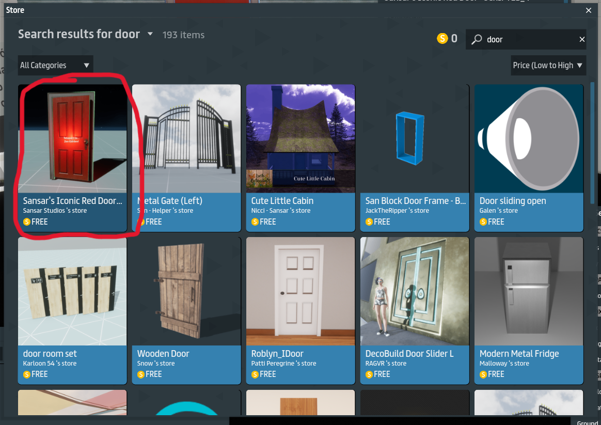

### Luces

Las **luces** son fundamentales para la ambientación del entorno. Este script permite configurar luces dinámicas que pueden cambiar de color, intensidad o activarse/desactivarse bajo ciertas condiciones.

#### Componentes:
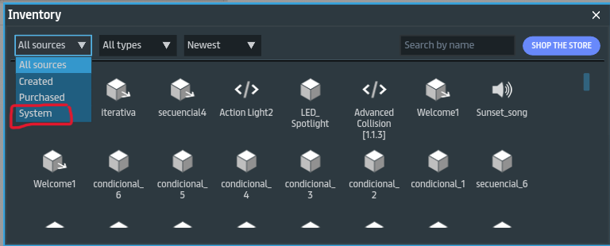

### Objetos

Los **objetos** en Sansar pueden ser interactivos y dinámicos. Este script permite mover, rotar o escalar objetos en respuesta a las acciones del jugador.

## Exportación de Archivos
- **Formatos**: Los modelos se exportan en **FBX** y **OBJ** para su uso en el mundo virtual.
- **Texturización**: Se utiliza **Autodesk Maya** para la texturización de los materiales, asegurando un acabado visual atractivo.

### Exportar Objetos (3D)

Para exportar objetos creados en herramientas de modelado 3D como Blender o Autodesk Maya y utilizarlos en Sansar

#### Pasos para exportar:
- Modelado: Crea o modifica el objeto 3D.
- Texturización: Asegúrate de aplicar correctamente las texturas y materiales.
- Exportación: Exporta el modelo en formato FBX o OBJ.
- Importación a Sansar: Sube el archivo en el editor de Sansar, ajustando las propiedades como escala y colisiones.
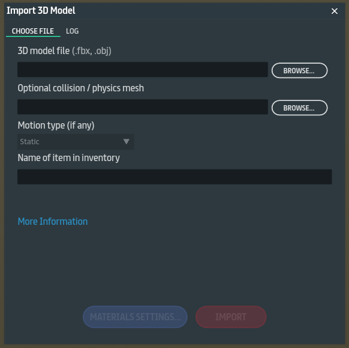

### Exportar Audio

Los audios pueden mejorar la experiencia inmersiva añadiendo efectos sonoros o música de fondo. Este script permite reproducir sonidos cuando el jugador entra en una zona específica o cuando interactúa con un objeto.

#### Pasos:
- Carga los archivos de audio en formato WAV o MP3.
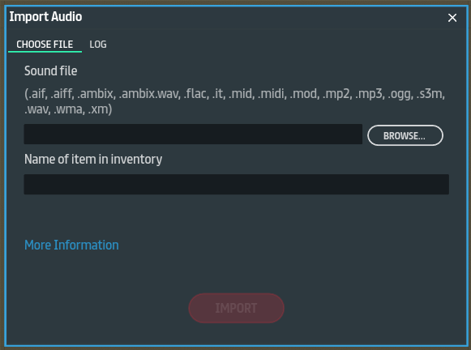

<!--Para más detalles sobre cómo colaborar en este proyecto, consulta nuestra [Guía de Contribución](ruta/a/la/guia_contribucion.md).-->

